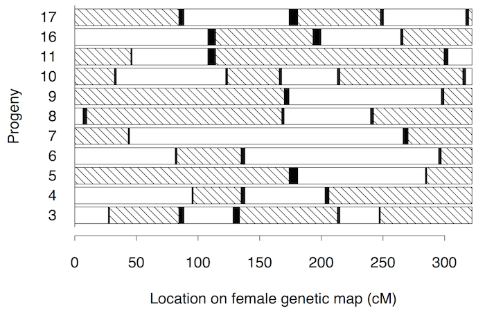

  

      <ul class="nav">
          <li><a href="inversion_fig2.html">prev</a></li>
          <li><a href="xchr_fig2.html">next</a></li>
      </ul>
  

Broman KW, Weber JL (2000) Characterization of human crossover
interference. [Am J Hum Genet](https://www.cell.com/ajhg/home) 66:1911-1926

**Figure 1**. &mdash; Grandparental phase in the maternal chromosomes 2, for
the 11 progeny from family 1331. Hatched segments denote
grandpaternal origin; unblackened segments, grandmaternal
origin. The smaller blackened segments are the noninformative
segments in which a recombination occurred.
