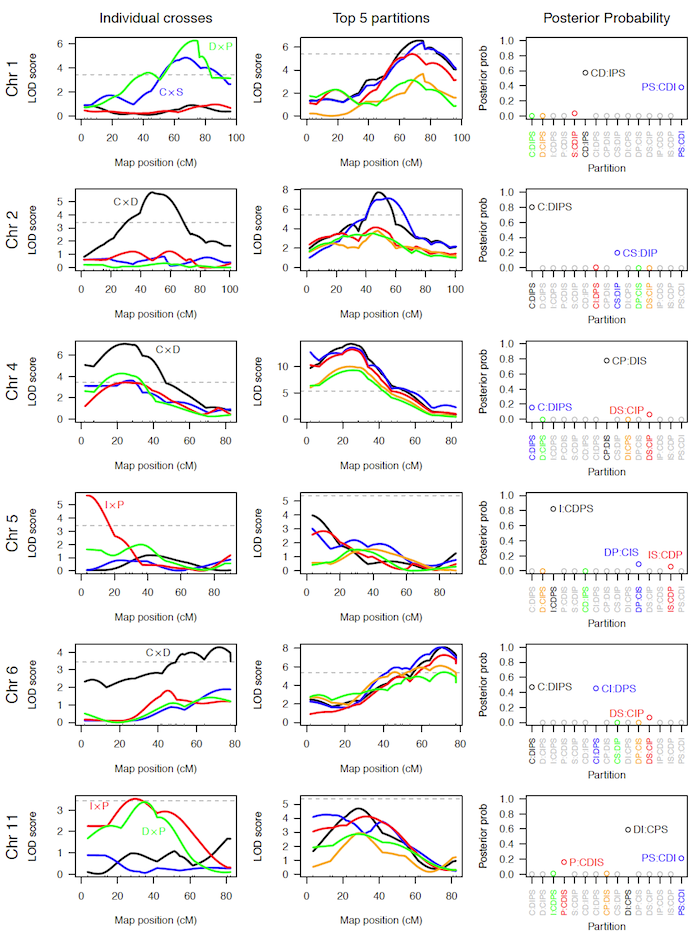

  

      <ul class="nav">
          <li><a href="rqtlexper_fig2.html">prev</a></li>
          <li><a href="phyloqtl_fig2.html">next</a></li>
      </ul>
  

Broman KW, Kim S, Sen &#346;, An&eacute; C, Payseur BA (2012) Mapping
quantitative trait loci onto a phylogenetic tree.  [Genetics](https://academic.oup.com/genetics)
192:267-279

**Figure 6**. &mdash; Analysis results for selected chromosomes for the data
from [Li et al. (2005)](https://www.ncbi.nlm.nih.gov/pubmed/15654110): LOD curves for individual crosses (left), LOD
curves for the top five partitions (middle), and approximate
posterior probabilities for each partition (right). The partitions
corresponding to the five LOD curves in the middle are indicated on
the right. The labeled points on the right indicate the partitions
included in the 95% Bayesian credible sets. On the left and in the
middle, dashed horizontal lines are plotted at the 5% significance
thresholds.
